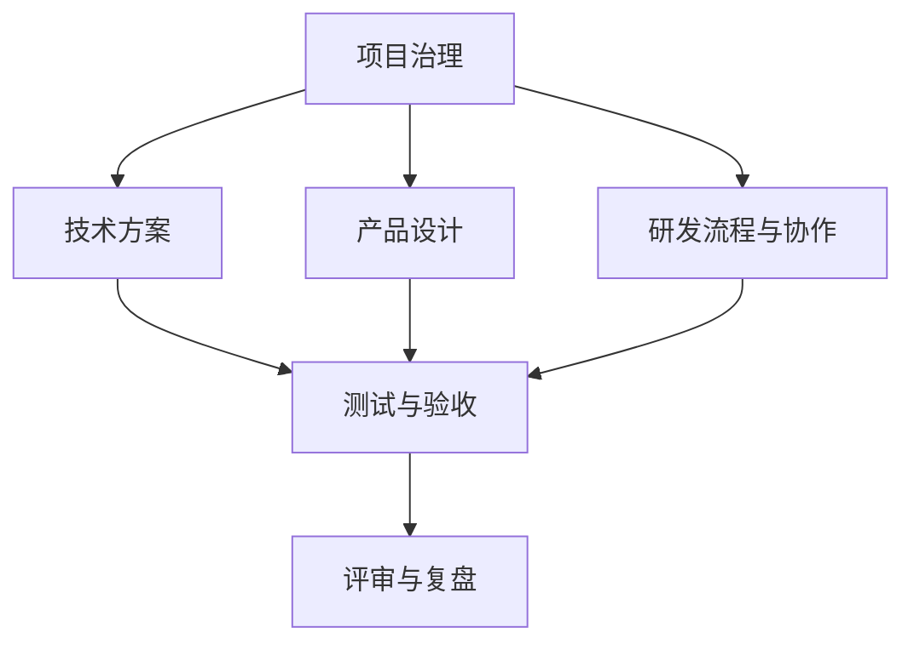

# FluentWork 文档导航与整理规则

**版本**：V1.0  
**日期**：2026-08  
**定位**：定义文档目录、归档规则与后续迁移策略

---

## 一、当前状态判断

当前仓库已经完成第一轮整理，结构为**单仓、`docs/` 分类归档**：

- 产品
- UI/UX
- 总体技术方案
- 后端方案
- iOS 端方案
- Prompt / 语料库
- 项目启动书
- 团队分工
- 评审记录

优点：

- 早期信息集中
- 检索简单

当前仍需持续改进的点：

1. `docs/40_研发流程与协作/`、`docs/70_外部研究/` 还缺内容；
2. 根目录还需要保持最小化，只保留仓库入口文件；
3. 后续新增文档需要严格按分类进入对应目录；
4. 如果未来拆分成 `meta / ios / backend / infra` 多仓，当前文档还要再做第二轮迁移。

结论：

> 第一轮归档已经完成，当前目标转为“保持分类稳定、补目录索引、为多仓拆分做准备”。

---

## 二、整理原则

### 2.1 本轮原则

当前已执行的第一轮整理包含三件事：

1. 新建 `/docs` 目录；
2. 将现有 Markdown 文档按主题迁入分类子目录；
3. 用导航页定义后续迁移规则。

第一轮没有做：

- 文档重命名
- 引用关系大规模修改

原因：

- 当前文档还在快速演进期，不适合同时做大规模重命名；
- 现有正文引用主要基于文档名，而不是相对路径；
- 先完成分类，再决定是否编号重命名，调整成本更低。

### 2.2 第二轮原则

当开始进入代码仓拆分和工程落地时，再执行第二轮整理：

1. 将治理文档迁入未来的 `fluentwork-meta` 仓；
2. 为每份核心文档补编号和索引；
3. 统一交叉引用路径；
4. 视需要拆分长文档或补 ADR。

---

## 三、推荐目录结构

```text
docs/
├── 10_项目治理/
├── 20_产品设计/
├── 30_技术方案/
├── 40_研发流程与协作/
├── 50_测试与验收/
├── 60_评审与复盘/
└── 70_外部研究/
```

### 3.1 分类说明

| 目录 | 内容 |
|---|---|
| `10_项目治理/` | 启动书、团队分工、GitHub/仓库策略、AI 协作规范 |
| `20_产品设计/` | PRD、UI/UX、用户路径、商业化说明 |
| `30_技术方案/` | 总体技术方案、后端方案、iOS 方案、Prompt 工程 |
| `40_研发流程与协作/` | 开发节奏、分支模型、Issue/PR 流程、Agent 使用规范 |
| `50_测试与验收/` | 测试计划、验收清单、真机方案、CI/CD、提审 Gate |
| `60_评审与复盘/` | 评审记录、阶段复盘、风险清单 |
| `70_外部研究/` | gstack、竞品、外部开源方案研究 |

---

## 四、现有文档的推荐归属

| 当前文件 | 后续目录 |
|---|---|
| `FluentWork项目启动书.md` | `docs/10_项目治理/` |
| `FluentWork团队分工文档.md` | `docs/10_项目治理/` |
| `FluentWork产品需求文档PRD.md` | `docs/20_产品设计/` |
| `FluentWork界面设计文档.md` | `docs/20_产品设计/` |
| `FluentWork技术方案设计文档.md` | `docs/30_技术方案/` |
| `FluentWork后端技术方案文档.md` | `docs/30_技术方案/` |
| `FluentWork-iOS App端技术设计文档.md` | `docs/30_技术方案/` |
| `FluentWork-Prompt工程与语料库设计文档.md` | `docs/30_技术方案/` |
| `FluentWork端到端注入能力验证文档.md` | `docs/50_测试与验收/` |
| `评审记录-W0.md` | `docs/60_评审与复盘/` |

---

## 五、命名规则

### 5.1 文件命名

推荐格式：

`数字前缀_主题名.md`

例如：

- `10_FluentWork-AI协作开源研发与CI-CD方案.md`
- `11_GitHub仓库拆分与权限模型.md`
- `12_AI工具角色分工与使用规范.md`

### 5.2 文档头部元信息

每份正式治理类文档必须包含：

- 版本
- 日期
- 定位
- 对应上游文档
- 变更说明

---

## 六、文档层级关系

推荐用下面的关系理解整个文档体系：



解释：

- `项目治理` 定规则；
- `产品设计` 定做什么；
- `技术方案` 定怎么做；
- `研发流程与协作` 定怎么组织人和工具；
- `测试与验收` 定怎么确认做对；
- `评审与复盘` 定怎么纠偏。

---

## 七、本轮新增文档落位

本轮新增的“AI 工具 + GitHub + CI/CD + 仓库拆分 + 开发时序”文档，落位为：

- `docs/10_项目治理/10_FluentWork-AI协作开源研发与CI-CD方案.md`

原因：

- 这是治理文档，不是纯技术细节文档；
- 它要约束仓库结构、开发顺序、AI 工具角色、Review Gate、CI/CD 门禁；
- 它天然属于项目治理层。

---

## 八、后续迁移顺序建议

建议按三批继续完善：

### 第一批：治理与流程

1. 启动书
2. 团队分工
3. 本文档
4. AI 协作 / GitHub / CI-CD 文档

### 第二批：产品与技术主文档

1. PRD
2. UI
3. 总体技术方案
4. 后端方案
5. iOS 方案
6. Prompt 方案

### 第三批：测试与复盘

1. 注入验证文档
2. 评审记录
3. 后续测试计划、提审 Gate、复盘文档

---

## 九、执行建议

当前执行结果：

1. `/docs` 已建立；
2. 现有 Markdown 文档已分类归档；
3. 根目录后续只保留仓库入口文件；
4. 第二轮再处理多仓迁移与编号体系。
