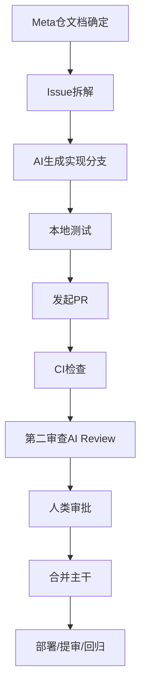

# FluentWork AI 协作、开源研发与 CI/CD 方案

**版本**：V1.0  
**日期**：2026-08  
**定位**：给 FluentWork 从“文档规划期”进入“AI 工具 + GitHub + 多仓库 + CI/CD 驱动开发期”的执行方案  
**上游依据**：`FluentWork项目启动书`、`FluentWork团队分工文档`、`FluentWork技术方案设计文档`、`FluentWork后端技术方案文档`

**组织现状更新**：GitHub 组织已创建：`https://github.com/FluentWork`

**仓库现状更新**：以下 4 个公开仓已创建并初始化（默认分支 `main`，README 已按仓库职责补齐并推送）：

- `https://github.com/FluentWork/fluentwork-meta`
- `https://github.com/FluentWork/fluentwork-ios`
- `https://github.com/FluentWork/fluentwork-backend`
- `https://github.com/FluentWork/fluentwork-infra`

---

## 一、目标与结论

当前 FluentWork 已经有：

- PRD
- UI/UX
- 总体技术方案
- 后端方案
- iOS 端方案
- Prompt/语料库方案
- 启动与分工基线

下一步不是继续堆文档，而是进入：

> **GitHub 组织化开发 + AI 工具分工协作 + 代码评审门禁 + CI/CD 驱动迭代**

### 直接结论

推荐采用：

1. **GitHub 组织下 4 个仓库起步**
2. **Trae + Claude Code + 第二审查 AI** 的三层协作
3. **GitHub Projects + Issues + PR 模板 + CODEOWNERS + Actions** 做主干治理
4. **先建 iOS 与后端骨架，再补 Prompt/Eval 与 Infra**
5. **从 W0/W1 就把 CI 建起来，不要等代码多了再补**

---

## 二、先回答核心问题：建立几个仓库

### 2.1 推荐方案：4 仓库

当前实际落地已采用该方案。

#### 仓库 1：`fluentwork-meta`

定位：

- 项目治理仓
- 文档与规格仓
- GitHub 项目管理入口

内容：

- PRD / UI / 技术方案 / 评审记录
- ADR
- 路线图
- 任务分解
- GitHub issue 模板
- 发布节奏与验收清单

为什么需要：

- 把“代码实现”和“项目治理”分开
- 让 AI 工具有一个稳定的文档事实源

#### 仓库 2：`fluentwork-ios`

定位：

- SwiftUI App 主仓

内容：

- iOS App 工程
- TGReduxKit / Factory 接入
- 页面、Store、Middleware、Service
- iOS 单测、快照测试、模拟器回归
- 后续 gstack 真机验证接入

#### 仓库 3：`fluentwork-backend`

定位：

- Go 后端主仓

内容：

- app-server
- voice-gateway
- worker
- schema
- migration
- 后端集成测试与契约测试

#### 仓库 4：`fluentwork-infra`

定位：

- 部署、环境、CI/CD、观测、Secrets 管理仓

内容：

- GitHub Actions 复用 workflow
- Dockerfiles
- docker-compose / k8s 预留
- 环境变量模板
- 部署脚本
- 监控与报警配置

---

## 三、替代方案与取舍

### 方案 A：2 仓库

- `fluentwork-meta`
- `fluentwork-app`（iOS + backend + infra 混在一起）

优点：

- 省管理成本

问题：

- iOS 和 Go 会互相污染流水线
- PR 过大
- AI 上下文噪音高

适用条件：

- 只有 1 人开发，且项目只验证 2-3 周

### 方案 B：3 仓库

- `fluentwork-meta`
- `fluentwork-ios`
- `fluentwork-server`（backend + infra）

优点：

- 比 4 仓库简单

问题：

- infra 变更会和后端业务变更混在同一个发布面

### 方案 C：4 仓库

这是本方案的推荐值。

原因：

- 结构够清晰
- 管理成本仍然可控
- 非常适合 AI 工具按角色分工

### 方案 D：5 仓库

在 4 仓库基础上再拆：

- `fluentwork-prompt-evals`

仅当满足以下条件时再拆：

1. Prompt / Eval 开始快速膨胀；
2. 需要严格区分脱敏数据与业务代码；
3. 需要单独的评估流水线和审批门禁。

当前阶段不建议立即拆第 5 个仓库。

---

## 四、推荐的 GitHub 组织结构

GitHub 组织已建立：`https://github.com/FluentWork`。  
当前重点不再是“是否建组织”，而是把仓库、权限、模板和自动化骨架补齐。

### 4.1 组织层配置

启用：

- GitHub Projects
- Teams
- Branch protection rules
- CODEOWNERS
- Dependabot alerts
- Secret scanning
- Issue / PR templates
- Discussion

### 4.2 Team 划分

建议最少分 3 个 team：

1. `core`
   - 最终 owner
   - 可 merge / 可 release / 可改规则
2. `ios`
   - iOS 仓 owner
3. `backend`
   - 后端仓 owner

AI 工具不需要 GitHub team，但对应的行为要通过：

- PR 模板
- Review Gate
- workflow

来被约束。

---

## 五、AI 工具如何分工

这里不建议“一个工具干所有事情”，而是按任务类型切角色。

## 5.1 Trae 的角色

适合：

- 长文档与多文档协同
- 项目治理文档维护
- 跨文件分析
- 需求到任务的拆解
- 方案评估与决策记录

不建议让 Trae 作为唯一编码工具的场景：

- 高频、本地、脚本式修补
- 大量 git/gh 命令驱动的实现流程

定位：

> Trae 更像“项目级编排与规格助手”。

## 5.2 Claude Code 的角色

适合：

- 本地仓编码
- 批量改动
- 读写工程文件
- 跑测试
- gh 命令操作 GitHub
- 修 bug 和补测试

定位：

> Claude Code 更像“主力实现 Agent”。

## 5.3 第二审查 AI 的角色

你提到“open code review”等 review 方式。这里建议明确成**第二意见审查层**。

可选：

- OpenAI / Codex 类工具
- 独立 review agent
- GitHub App 形式的 AI review

它的职责不是替代主评审，而是：

1. 找逻辑漏洞
2. 找回归风险
3. 找测试缺口
4. 给出“不同模型视角”的反证

定位：

> 第二审查 AI 不负责写主实现，负责“挑刺”。

---

## 六、推荐的 AI 协作矩阵

| 环节 | 主工具 | 辅助工具 | 目的 |
|---|---|---|---|
| 文档规划 | Trae | Claude Code | 产出 spec、治理文档、任务分解 |
| 本地编码 | Claude Code | Trae | 产出实现、测试、修复 |
| PR 自检 | Claude Code | gh + Actions | 跑本地测试、补提交说明 |
| PR 第二审查 | 第二审查 AI | GitHub review | 找 bug、风险、漏测 |
| 合入前人审 | 人类 | AI review 结果 | 最终判断 |
| 发布与回归 | Claude Code | GitHub Actions | 做 release gate、回归、产物 |

---

## 七、完整开发流程建议

### 7.1 Phase 0：规格冻结

在 `fluentwork-meta`：

1. 文档更新
2. ADR 落盘
3. 开 Issue
4. 给每个 Issue 标明：
   - 所属仓库
   - 上下游文档
   - 验收标准
   - 禁区

### 7.2 Phase 1：AI 实现分支

在代码仓：

1. 基于 issue 建 feature branch
2. Claude Code 负责编码
3. 必须同时补测试

### 7.3 Phase 2：本地门禁

本地最少通过：

- build
- lint
- unit test
- 必要的 integration test

### 7.4 Phase 3：PR 门禁

PR 必须经过：

1. GitHub Actions
2. 第二审查 AI
3. 人类审批

### 7.5 Phase 4：发布门禁

按仓库分别走：

- iOS：构建、测试、模拟器验证、签名、TestFlight
- backend：构建、测试、镜像、部署、health check
- infra：环境变更审批、部署、回滚验证

---

## 八、CI/CD 设计建议

## 8.1 `fluentwork-meta`

CI：

- Markdown lint
- Link check
- Mermaid basic render check
- 文件命名规范检查

CD：

- 无需部署
- 可自动发布文档站点到 GitHub Pages

## 8.2 `fluentwork-ios`

CI 必做：

1. Swift format/lint
2. 单元测试
3. reducer / state machine 测试
4. 快照测试
5. iPhone 17 Pro 模拟器 smoke run

CD 分层：

1. `develop` 分支
   - 内部 debug 构建
2. `release/*`
   - TestFlight build
3. `main`
   - 仅保留已验证可发布代码

后续增强：

- gstack 真机验证作为 release gate 的附加步骤

## 8.3 `fluentwork-backend`

CI 必做：

1. `go fmt`
2. `go vet`
3. unit tests
4. integration tests
5. schema / migration check
6. contract tests
7. Docker build

CD：

1. `develop`
   - 部署到 dev
2. `staging`
   - 部署到 staging
3. `main`
   - 人工审批后部署 prod

## 8.4 `fluentwork-infra`

CI：

- YAML / Terraform / Helm lint
- Secrets 引用检查
- reusable workflow 测试

CD：

- 需要 environment approval
- 所有 prod 变更必须带回滚说明

---

## 九、Review 机制怎么设计

你特别提到 review，这里建议采用三层：

### 9.1 第一层：作者自检

由主实现 AI 或开发者完成：

- 是否满足 Issue 验收标准
- 是否补了测试
- 是否改了不该改的文件

### 9.2 第二层：AI 对抗式审查

由第二审查 AI 完成，重点看：

- 回归风险
- 边界条件
- 漏测
- 架构偏离

要求：

- Findings first
- 带文件与行号
- 不要只给总结

### 9.3 第三层：人类审批

人类只看最重要的：

- 改动是否值得存在
- 架构是否跑偏
- 是否影响里程碑节奏

这是最高 gate，不能省。

---

## 十、什么时候开始什么部分的开发

这里直接给你与当前 FluentWork 阶段匹配的时序。

## 10.1 现在：先做仓库和治理，不先冲代码

当前最先做的不是业务代码，而是：

1. 配置 team、模板、分支保护、Actions 骨架
2. 将当前文档同步到 `fluentwork-meta`
3. 把里程碑拆成 Issues
4. 初始化 `fluentwork-ios` 与 `fluentwork-backend` 代码骨架
5. 再启动核心链路开发

原因：

- 没有这个骨架，AI 工具会快速制造“产出很多，但不可维护”的假繁荣。

## 10.2 第一个开发波次：iOS 与 backend 骨架并行

开始条件：

- meta 仓治理文档已就位
- issue 模板和 PR 模板已上线
- CI skeleton 已可运行

先做：

### iOS

- App 工程骨架
- TGReduxKit / Factory 接入
- 根路由
- 工作台空骨架
- 说的房间状态容器骨架
- 测试基线

### backend

- app-server 骨架
- voice-gateway 骨架
- auth/material/session/corpus 基础模块
- migration 与 config
- health/readiness

原因：

- 这两条线先起骨架，后续 AI 产能才有稳定承载面

## 10.3 第二个开发波次：先打“说 -> 读 -> 入库”

优先级：

1. 说的房间主链路
2. session 落库
3. review 异步生成
4. 语料入库

不要先做：

- 订阅
- 复杂运营后台
- 低优先级装饰体验

原因：

- 这是核心假设验证闭环

## 10.4 第三个开发波次：闪测与话题卡

前提：

- 说-读-入库已经打通

再做：

- 调度引擎
- 闪测
- 话题建议
- APNs

## 10.5 第四个开发波次：提审与内测门禁

开始条件：

- 代码不是越多越好，而是主路径稳定

这一阶段的核心不是新功能，而是：

- release branch
- TestFlight 流程
- 真机/模拟器回归
- 部署/监控/回滚

---

## 十一、建议的分支模型

推荐简单模型，不要上复杂 GitFlow。

### 主分支

- `main`
  - 可发布
- `develop`
  - 日常集成

### 辅助分支

- `feature/<issue-id>-<topic>`
- `release/<version>`
- `hotfix/<topic>`

规则：

1. feature -> develop
2. release 从 develop 切出
3. 验证通过后 release -> main 与 develop
4. hotfix 从 main 切

---

## 十二、Issue / PR 体系建议

## 12.1 Issue 分类

建议 label：

- `ios`
- `backend`
- `infra`
- `meta`
- `prompt`
- `test`
- `bug`
- `spec`
- `blocked`
- `release`

## 12.2 PR 模板必须包含

1. 上游 issue
2. 关联文档
3. 验收点
4. 测试结果
5. 风险点
6. 是否需要第二审查 AI 强审

---

## 十三、开源 GitHub 能力要怎么充分利用

### 13.1 GitHub Projects

用途：

- 管理里程碑
- 管理 issue 状态
- 让 AI 产出不脱离项目节奏

### 13.2 GitHub Actions

用途：

- 把测试门禁自动化
- 把发布动作标准化

### 13.3 CODEOWNERS

用途：

- 强制关键目录必须过人审

推荐：

- iOS 音频 / 状态机目录必须 owner 审批
- 后端网关状态机目录必须 owner 审批
- infra 的 prod 工作流必须 owner 审批

### 13.4 Discussions

用途：

- 承接开放问题、调研记录、方案比较

### 13.5 Dependabot / 安全扫描

用途：

- 早期就建立供应链安全基线

---

## 十四、你现在就该怎么开始

按顺序：

1. 建 `docs` 目录与本轮治理文档
2. 先把当前文档迁入 `fluentwork-meta`
3. 建 issue 模板、PR 模板、CODEOWNERS、Actions skeleton
4. 配置 team、branch protection、Projects
5. 初始化 `fluentwork-ios`、`fluentwork-backend`、`fluentwork-infra`
6. 再开始 iOS 与 backend 骨架编码

这一顺序不能反。

如果反过来先写代码，会立即出现：

- 文档与代码脱节
- AI 工具角色混乱
- PR 无法治理
- CI/CD 只能事后补洞

---

## 十五、推荐的首批仓库任务

### `fluentwork-meta`

首批任务：

1. 导入现有文档
2. 补 `README`
3. 建 `docs/10_项目治理`、`20_产品设计`、`30_技术方案`
4. 建里程碑 issue 列表

### `fluentwork-ios`

首批任务：

1. SwiftUI 工程初始化
2. TGReduxKit / Factory 骨架
3. AppState / RootStore
4. iPhone 17 Pro 模拟器 smoke test
5. SwiftLint / test workflow

### `fluentwork-backend`

首批任务：

1. Go module 初始化
2. app-server / voice-gateway 目录
3. health / config / logging
4. migration 基线
5. CI workflow

### `fluentwork-infra`

首批任务：

1. 环境变量模板
2. reusable workflow
3. deploy skeleton
4. monitoring skeleton

---

## 十六、最终建议

对 FluentWork 当前阶段，最优策略不是“继续补更多设计文档”，而是：

> **用一个治理仓承接文档，用两个主代码仓承接实现，用一个基础设施仓承接 CI/CD 和部署，把 AI 工具明确分成“规划”“实现”“第二审查”三种角色，从第一天就把门禁和节奏搭起来。**

推荐落地值：

- 仓库数：4
- 主实现工具：Claude Code
- 规格与多文档规划：Trae
- 第二审查：独立 AI review
- GitHub 主控：Projects + Issues + PR + Actions + CODEOWNERS
- 开发起点：先 meta / infra 骨架，再 ios / backend 骨架并行，再打核心闭环

---

## 十七、审核后建议进入的下一份文档

本文件通过后，下一步应拆两份执行级文档：

1. `11_GitHub仓库初始化与权限模型.md`
2. `12_AI工具角色分工与Review Gate执行细则.md`

这样才能从“治理总方案”进入“可执行 runbook”。
